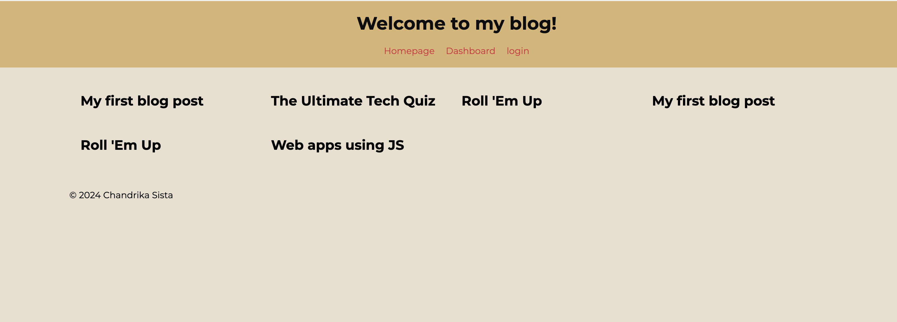

# Tech blog using express.js and handlebar templates

## Simple blog site that gives the option to login/signup, add, delete and update posts and comments

## Features

- The code can be downloaded to you local machine and can be run using `npm start`
- New users can sign up on the login page.
- Users can see the existing blog posts even without logging in, but they need to be logged in to edit or delete their posts.
- Users can leave comments on any post.

## Installation Instructions

- Download the files from the repo
- Run `npm install` to install the necessary dependencies
- Run `npm start` and go to https://localhost:3001 to view the blog

## Website Preview

## Working Example
[View the website here](https://gcsdesign-blog-43fec2242915.herokuapp.com/)

